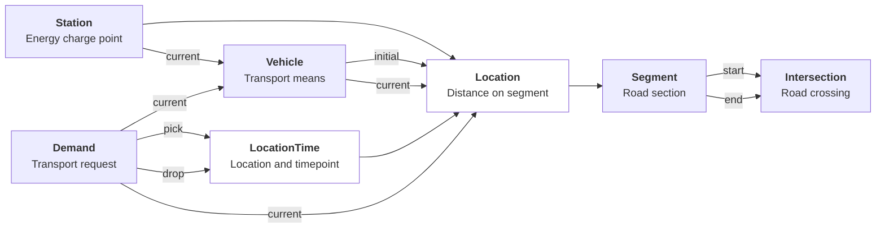
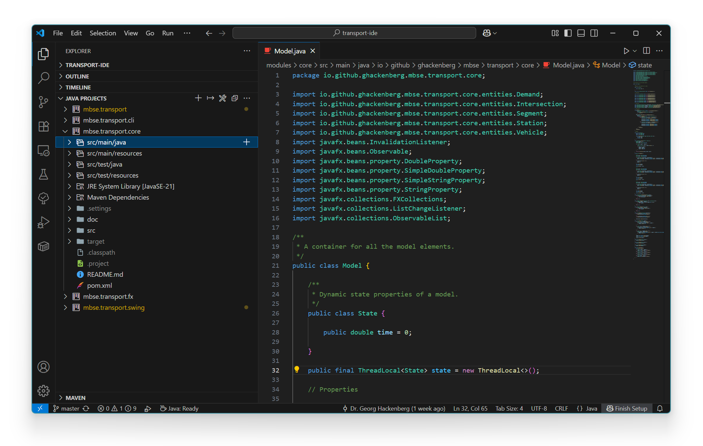
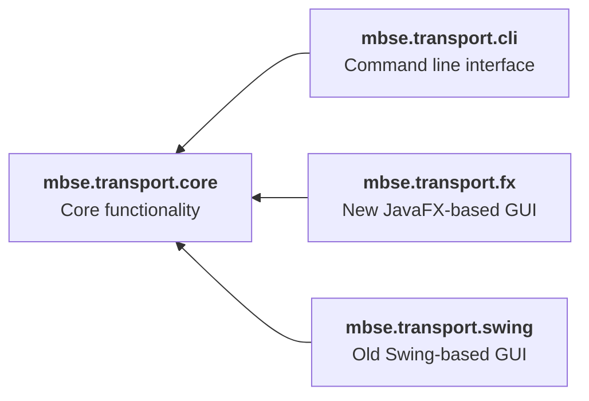

# Transport-IDE

The goal of **Transport-IDE** is to make the life of *transportation infrastructure* and *control strategy engineers* easier.
We believe that this engineering domain needs new tools and methodologies to develop better systems with higher performance in shorter time and at lower lifetime cost.
In particular, we think that transportation system engineers must be supported better in

1. analyzing requirements for specific application scenarios (e.g. travel time and energy consumption) as well as
2. deriving, verifying, and validating principle solution variants (including transportation, charge, and maintenance infrastructure as well as control strategy).

**Transport-IDE** is an *open source software project* initiated by Dr. Georg Hackenberg, Professor for Industrial Informatics, School of Engineering, [University of Applied Sciences Upper Austria](https://fh-ooe.at/) and Dominik Ascher, Research Associate, Distributed Artificial Intelligence Laboratory, [Technical University of Berlin](https://www.tu.berlin/).

## Screenshots

Here are some screenshots of Transport-IDE in action:

## Features

Here is a list of currently supported features of Transport-IDE:

- ⭐ *System modeling*
  - **Driving infrastructure** through *intersections* and *segments*
  - **Charging infrastructure** through *stations*
  - **Fleet configurations** through *vehicles*
  - **Load scenarios** through *demands*
- ⭐ *Control strategies*
  - **Random strategy** throwing the dice for every decision
  - **Manual strategy** asking the user for every choice to be made
  - **Greedy strategy** behaving randomly unless demand can be dropped
  - **Smart strategy** based on shortest path algorithm
- ⭐ *Scenario simulations*
  - **Discrete-event semantics** for minimal computational effort
  - **Monte-Carlo experiments** for statistical behavior analysis
  - **Multi-threaded executions** for maximum computation speeds

Feel free to request new features via GitHub issues!

## Concepts

The following diagram provides an overview of the modeling concepts:

## Requirements

To build and run the project you need to following software packages:

- [OpenJDK](https://openjdk.org/) provides a **Java compiler and runtime environment**
- [Apache Maven](https://maven.apache.org/) provides a **dependency management and build configuration tool**

To work on the code you can use the following software package:

- [Eclipse IDE for Java Developers](https://www.eclipse.org/) the traditional way of Java coding
- [IntelliJ IDEA](https://www.jetbrains.com/idea/) the professional way of Java coding
- [Visual Studio Code](https://code.visualstudio.com/) + [Extension Pack for Java](https://github.com/Microsoft/vscode-java-pack) a nice, modern, and lightweight alternative (our preferred solution!)

Here is a screenshot of our Visual Studio Code setup in action:

## Modules

This software packages comprises three modules and their dependencies.
The following diagram provides an overview of the software modules included.
Technically, the software modules are implemented as Java Jigsaw and Apache Maven modules.

Learn more about the modules here: [`Core`](./modules/core/), [`CLI`](./modules/cli/), [`FX`](./modules/fx/), and [`Swing`](./modules/swing/).

## Folders

Here is a brief description of the top-level folder structure of this repository:

* 📁 [**Modules**](../modules/) Contains the source code of the various software modules.
* 📁 [**Models**](../models/) Contains sample system models used for testing and demonstration.
* 📁 [**Images**](../images/) Contains image material used in the documentation.
* 📁 [**Prototypes**](../prototypes/) Contains prototypes of new functionalities to be added later.
* 📁 [**Manuscripts**](../manuscripts/) Contains source code of publications written in Latex.

## Documents

And here are some top-level documents to check out before getting started:

* 📄 [**LICENSE.md**](./LICENSE.md) Contains information about the license for this source code.
* 📄 [**CANGELOG.md**](./CHANGELOG.md) Contains information about software versions and changes included.
* 📄 [**CONTRIBUTING.md**](./CONTRIBUTING.md) Contains information for contributors to this software project.

## Publications

And, finally, here is a list of publications related to this software project:

1. [**Next-Generation Design Tools for Intelligent Transportation Systems** `MODELSWARD 2025`](https://www.scitepress.org/PublishedPapers/2025/131832/)
1. [**A Discrete Event Formalism for Fast Simulation of On-Demand Transportation Systems** `ISDA 2024`](https://link.springer.com/chapter/10.1007/978-3-031-64850-2_17)
1. [**Model-Based Design of Integrated Transportation Systems Using Approximate Dynamic Programming** `ITSC 2023`](https://ieeexplore.ieee.org/abstract/document/10422359)
1. [**The passenger extension of the TRANSP-0 system design framework** `MT-ITS 2017`](https://ieeexplore.ieee.org/abstract/document/8005676)
1. [**The TRANSP-0 framework for integrated transportation and power system design** `ITSC 2016`](https://ieeexplore.ieee.org/abstract/document/7795669)
1. [**Integrated transportation and power system modeling** `ICCVE 2015`](https://ieeexplore.ieee.org/abstract/document/7447633)
1. [**Early estimation of multi-objective traffic flow** `ICCVE 2014`](https://ieeexplore.ieee.org/abstract/document/7297511)

See [PUBLICATIONS.md](./PUBLICATIONS.md) for information about the workshops, conferences, and journals as well as article abstracts and Bibtex entries.