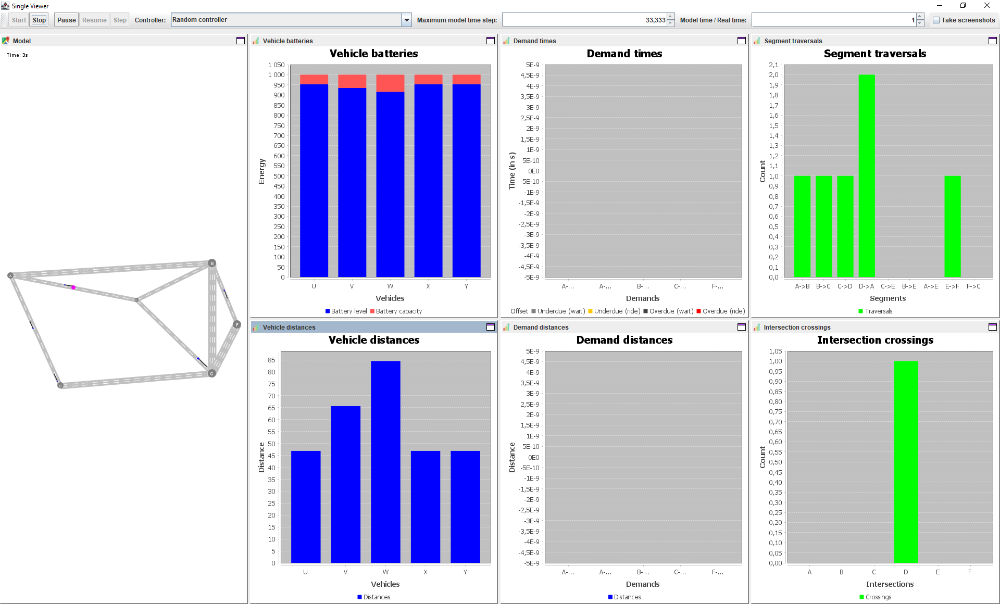
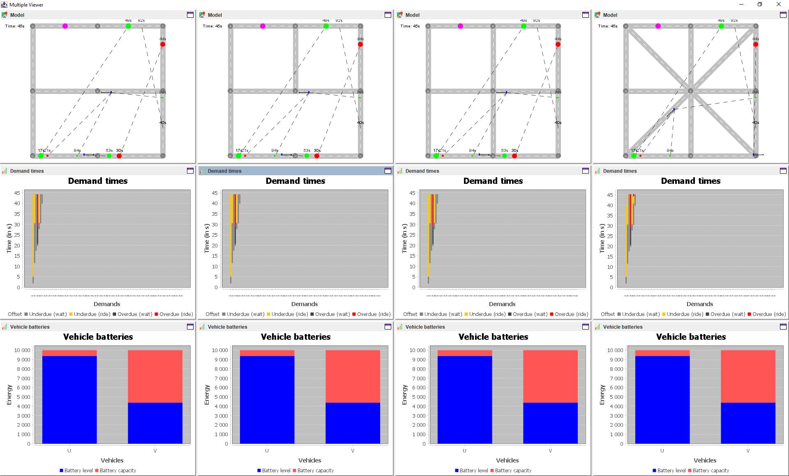

# Screenshots

This software package supports several use cases from basic simulation to controller and infrastructure comparison.
In the following, we provide brief descriptions and screenshots of the individual use cases.

## 🖼️ Basic simulation

Basic simulation allows one to evaluate system performance for a given controller algorithm and transportation infrastructure.

## 🖼️ Controller comparison

Controller comparison allows one to evaluate system performance for a set of controller algorithms and a given transportation infrastructure.

## 🖼️ Infrastructure comparison

Infrastructure comparison allows one to evaluate system performance for a given controller algorithmn and a set of transportation infrastructures.

