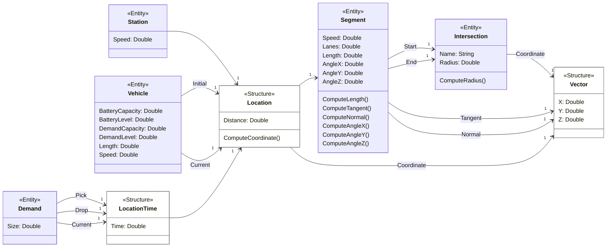
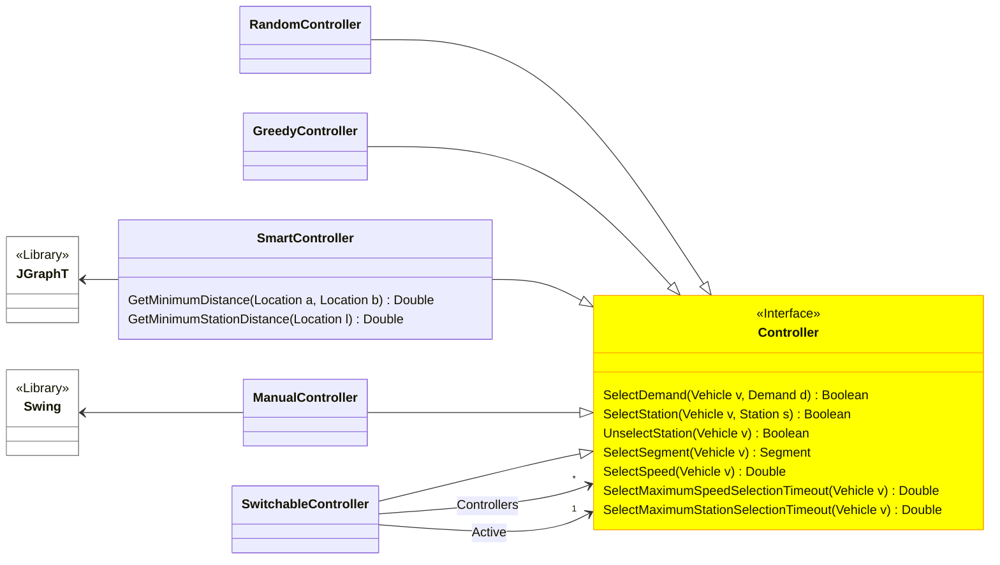
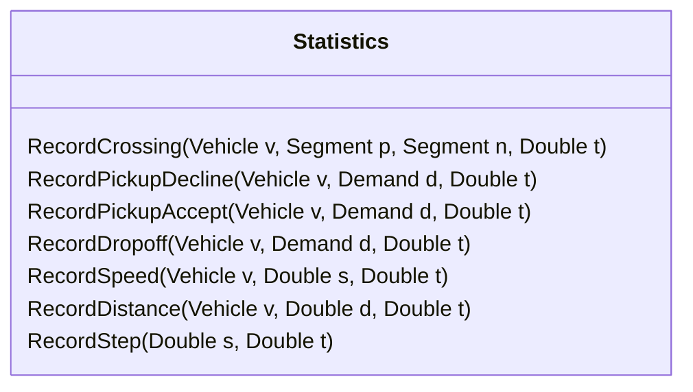

# `Core` module

In the following, we describe the contents of the core module. The core module comprises the model itself, a controller interface and several controller implementations, and a statistics class.

## `Model` classes

The model represents the concepts for modeling intelligent transportation systems and distinguishes structures and entities.
The structures include 3D-vectors as well as locations and location-times.
The entities include intersections and segments (i.e. the driving infrastructure), stations (i.e. the charging infrastructure), as well as vehicles and demands.

## `Controller` classes

The controller interface is responsible for plugging different control algorithms into the simulation engine.
Through this mechanism, the simulation engine is decoupled from the control strategies, that drive the system behavior.
The module also contains different implementations of the controller interface such as a random controller or a JGraphT-based controller.

## `Statistics` classes

The statistics class is responsible for collecting performance data during simulation experiments.
The performance data is necessary to compare infrastructure and control algorithm designs in specific situations.
The class assumes that performance data is collected only in specific events such as a vehicle passing a road crossing.

