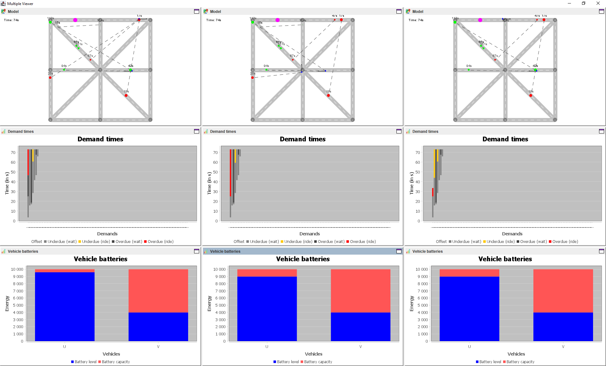

# `Swing` module

This software package supports several use cases from basic simulation to controller and infrastructure comparison.
In the following, we provide brief descriptions and screenshots of the individual use cases.

## `BasicSimulation` program

Basic simulation allows one to evaluate system performance for a given controller algorithm and transportation infrastructure.

## `ControllerComparison` program

Controller comparison allows one to evaluate system performance for a set of controller algorithms and a given transportation infrastructure.

## `ModelComparison` program

Model comparison allows one to evaluate system performance for a given controller algorithmn and a set of transportation infrastructures.

